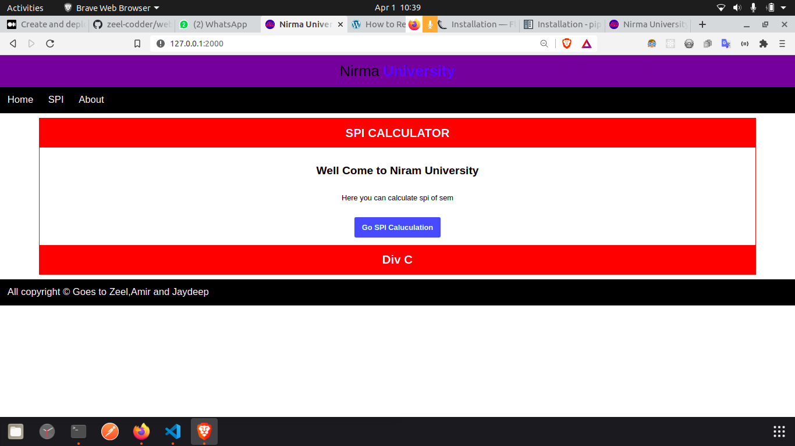
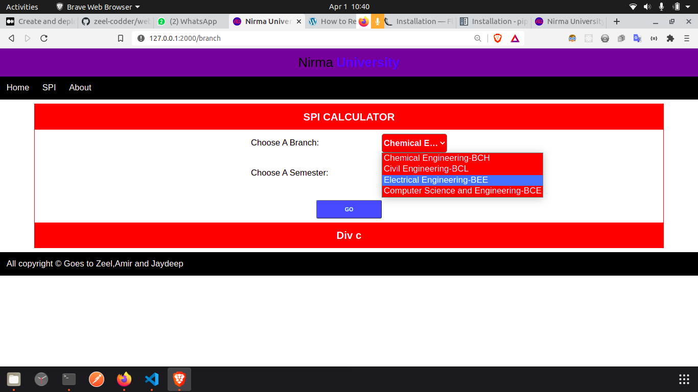
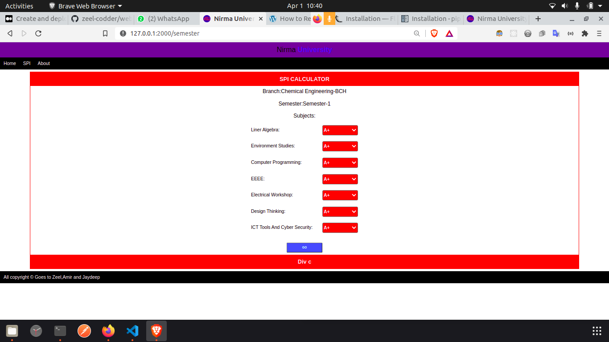
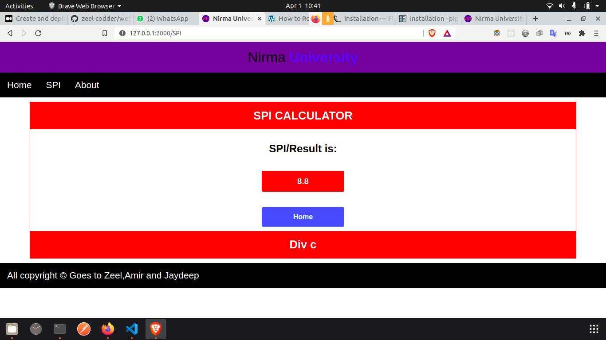

 
## PROJECT
 
SPI CALCULATOR
 
## Description
 
This project is used to find spi of student of nirma university Technology. Currently we have only four branch data so user can only calculate the spi of four branch.
 
### Branches
 
1.BCH
 
2.BEE
 
3.BCE
 
4.BCL
 
 
### Run App Local:
 
@ This app is created in Python Flask.
 
1.Python:
 
[Download](https://www.python.org/downloads/)
 
2.pip
 
```bash
 
python3 install pip
 
```
 
or
 
```bash
 
py get-pip.py
 
```
 
3.Flask Api
 
```bash
 
pip3 install Flask
 
```
 
4.Jinja for Frentend
 
```bash
 
pip3 install Jinja
 
```
 
5.Flask-Markdown
 
```bash
 
pip3 install Flask-Markdown
 
```
 
Now you're good to go.
Just run below command for run flask app.
 
goto->root folder
 
```bash
 
python3 app.py
 
```
 
## How to use App:
 
# Goto: [Home](https://zeelprajapati123.pythonanywhere.com/)
 

 
# Than Go to Spi
 

 
# Select Branch and Semester Than Hit Go
 

 
 
# Select Your Grade in Each Subject Than Hit Go
 

 
 
 
## Thank You For Reading Over Doc.
 
# Happy Coding
 
 
 
 

